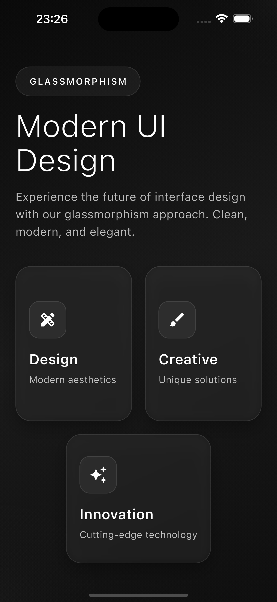

# Glassmorphism UI Design

A modern, professional Flutter application showcasing the power and beauty of Glassmorphism design principles. Built with clean, elegant code and featuring a sophisticated black and white color scheme.

## ✨ Features

- **Pure Glassmorphism Effects**: Real backdrop blur, transparency, and refined borders
- **Monochrome Design**: Sophisticated black and white color palette
- **Smooth Animations**: Subtle rotating background elements and fade-in transitions
- **Responsive Layout**: Optimized for various screen sizes and orientations
- **Professional Code Structure**: Clean, maintainable Flutter code following best practices
- **No External Dependencies**: Built entirely with Flutter's built-in capabilities

## 🎨 Design Elements

- **Backdrop Blur**: Advanced blur effects for depth and layering
- **Transparency Layers**: Subtle opacity variations for visual hierarchy
- **Refined Borders**: Elegant border treatments with proper contrast
- **Gradient Backgrounds**: Sophisticated dark gradients for depth
- **Glass Cards**: Interactive elements with glassmorphism styling
- **Typography**: Clean, modern text hierarchy and spacing

## 🚀 Getting Started

### Prerequisites

- Flutter SDK (3.0.0 or higher)
- Dart SDK (3.0.0 or higher)
- Android Studio / VS Code with Flutter extensions

### Installation

1. Clone the repository:
```bash
git clone https://github.com/Nannoy/Glassmorphism-UI-Design.git
cd glassmorphism
```

2. Install dependencies:
```bash
flutter pub get
```

3. Run the application:
```bash
flutter run
```

## 📱 Screenshots



*Screenshot taken on iPhone 16 Plus simulator*

The app features:
- Elegant header with glassmorphism badge
- Interactive feature cards with backdrop blur
- Smooth scrolling experience
- Professional typography and spacing
- Subtle animated background elements

## 🏗️ Architecture

- **State Management**: Uses Flutter's built-in StatefulWidget
- **Animation Controllers**: Smooth transitions and background animations
- **Custom Widgets**: Modular, reusable components
- **Responsive Design**: Adapts to different screen sizes
- **Performance Optimized**: Efficient rendering with CustomScrollView

## 🎯 Key Components

- `GlassmorphismApp`: Main application widget
- `GlassmorphismHomePage`: Home page with glassmorphism effects
- `_buildGlassCard`: Reusable glassmorphism card component
- `_buildFeatureSection`: Feature showcase section
- `_buildBottomSection`: Call-to-action section

## 🔧 Customization

The app is designed to be easily customizable:

- **Colors**: Modify the color scheme in the theme configuration
- **Animations**: Adjust animation durations and curves
- **Layout**: Modify spacing, padding, and component sizes
- **Content**: Update text, icons, and feature descriptions

## 📄 License

This project is open source and available under the [MIT License](LICENSE).

## 🤝 Contributing

Contributions are welcome! Please feel free to submit a Pull Request.

## 📞 Support

If you have any questions or need support, please open an issue on GitHub.

---

Built with ❤️ using Flutter
